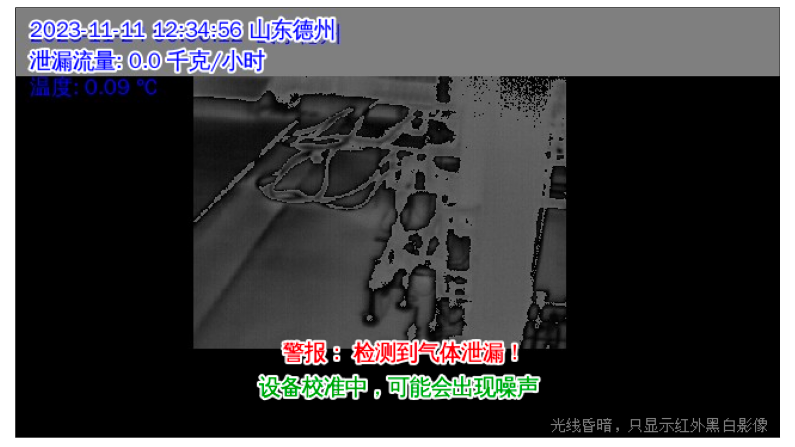

# 2023.12.4-10

#### Testing new IR camera

Xinyang bought a 光智 ir camera. I've played around with it for a while. Comparison with our current iray camera:

- broader field of view 

- Same NETD, ~40 mK

- More camera heating when working 

- Better imaging quality inspected by eye (left: GuangZhi, right: iray)

  

More serious analyses should be done by fetching their video data. I'll do it in the future and come up with a plan on our IR camera choice. 

#### Test: how small are our methane gas signals?

On raw ir images, methane gas signals are only 6-12 out of 10,000 compared with the IR background. So we MUST use IR cameras with >=14 bit depth (1/16,384). Below shows the ir camera readout of a single pixel (white crosses) vs time while we are doing the gas release experiments in ShanDong. When the methane gas passes through the pixel, there is a dip on the curve.

#### Investigating the Dezhou non-detection event

On Dec 4, 2023 there was a large gas-leak event in 装车泵区 in Dezhou, yet our camera didn't alert on it. Probable causes are

- Motion masks triggered by the "white smoke" generated by the cold LNG masked out the regions for detection. I've confirmed this probability using post-processing code (black squares are motion masks):

 

- I wrongly added a heavy oval filter on this cam, which lowered its detection ability.

See https://trello.com/c/F2psfiID for a detailed analysis of this event. As for the algorithm part, we need to develop an algorithm to detect the white smoke. My quick thought is that we can use IR motion mask instead and raise std_cutoff (as white smoke signals are much larger). I'll be working on it in the future. 

# **2023.11.27-12.1**

#### **New night mode**

1. Our existing day/night switching method didn't work well in the Shandong case. I've studied the following methods with 24-hr video data (Note: by eye inspection, camera 206&207 need to switch to the night mode at night due to the significant noise)

   1. luminance threshold. Can't distinguish 206/207 from the other cameras.
     

   2. Color saturation. Better but still not working.

      

   3. Red-channel difference between two adjacent frames. It works! (the threshold is around 30)

      

2. Cameras switch between day/night modes frequently when it's dawn and dusk. I added a 5-min time interval to smooth the curve and solved the problem.

#### New text look

1. Added white strokes to texts so that they can be more clearly seen. Removed the white background of texts.
2. Use relative positions and fontsizes. Text display won't change when vis images are rescaled.
3. Modified the text-related parameters in detectors.json so that they are fewer and cleaner.

​	Old look

​	New look

#### Debug: ir video display issue

Issue: when in night mode, the displayed ir image looks unnatural. The light distribution isn't continueous.

Solution: found that the pixel values are truncated when converting from 16-bit to 8 bit. Fixed it.

Old look

New look

#### Test on gas detection: using std of std

Is "std of std" a better way of detecting gas compared to "std"? Found that the gas signal doesn't become more significant in a std-of-std video. 

std

std of std

# **2023.10.23-27**

- Learned how to use git
- Learned how to connect and retrieve data from a nano machine 
- Code modification
  - postprocessing_single/postprocessing_v5.py
    - Corrected video flip methods 
    - New debug mode: choose frames to save if the videos are too long
    - removed ffc_availability, merged its logic to ffc_state
    - modified gradient_filter(), now weights apply to layers only once
  - postprocessing_modulized
    - added frequently used function cv_gas.scale_zoom_crop
    - modified cv_gas.get_vis_for_display accordingly
  - alignment: new keyboard controls

- Collaborated on the gas release experiment, retrieved the data, waiting to be analyzed
  - optimized the experiment report
- Created docs on the parameters in detectors.json, for future GUI integration by WenJie

